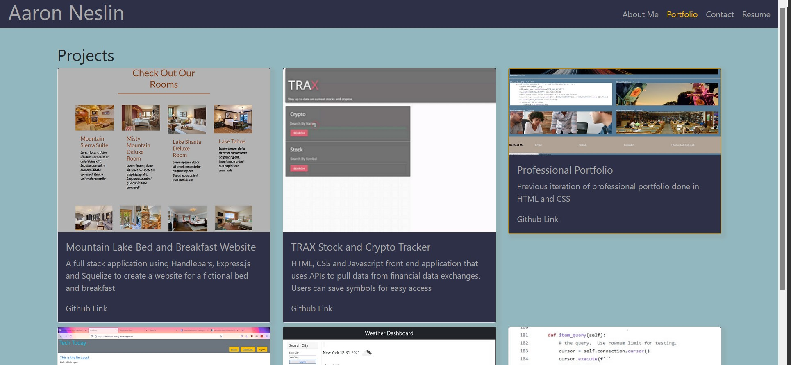

# React Portfolio

## Description
Portfolio for me based done using the React Framework.  Uses a single page, but nav bar will conditionally render elements to create the appearance of multiple pages.
Includes 8 Components:
* Header - appears on every page
* Footer - appears on every page
* Nav -nested within the Header
* Portfolio - has projects
* Projects, which is used to parse the array of projects into cards
* Resume - includes resume plus an option to download at the bottom
* About - has an about section
* Contact - a contact form. There is no database so it does not work

## Tools
* React
* Bootstrap

## Features
* Single page App.  Each "page" is conditionally rendered
* Nav bar.  Current selection will be highlighted
* Dynamic Portfolio.  Projects exist in an array.  More can be added without a need to rework the formatting
* Contact form that will enforce proper formats and required fields
* Resume page that includes and option to download the resume

## Screenshot

## Deployed Application
[Deployed application](https://aneslin.github.io/aneslin-react-portfolio/)

### note
I don't have a third public profile